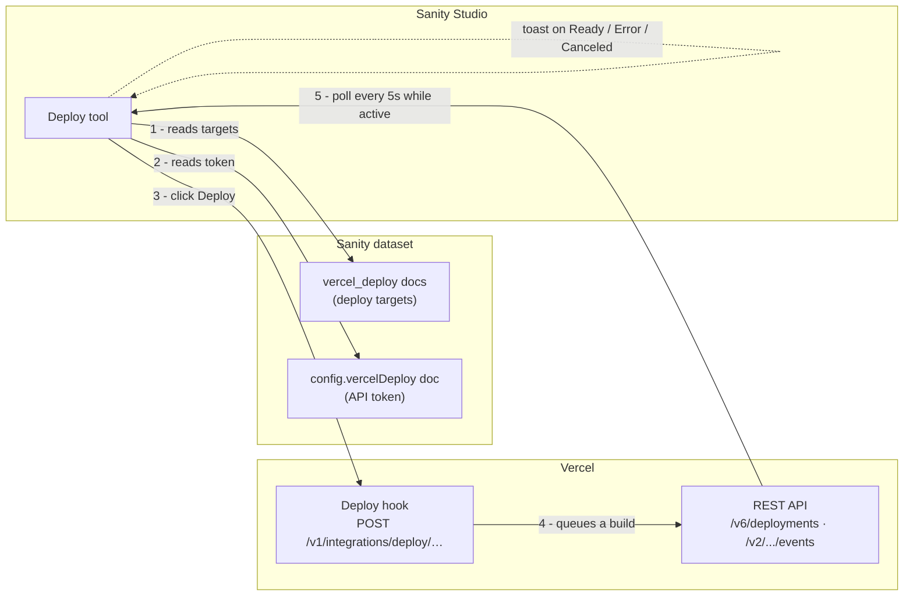
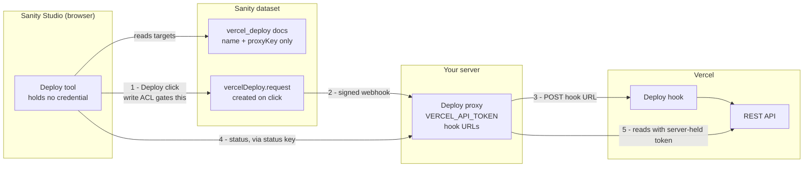

# deploy-vercel-from-sanity

**Trigger and monitor Vercel deployments directly from [Sanity Studio](https://www.sanity.io) — no context switching required.**

[](https://www.npmjs.com/package/@overpunch/deploy-vercel-from-sanity)
[](https://www.sanity.io)
[](./LICENSE)


> **Using Sanity but not setting it up?** Your developer installs this once. Day
> to day you'll only use the **Deploy** tab — see [Using it day to day](#using-it-day-to-day).

```bash
npm install @overpunch/deploy-vercel-from-sanity
```

---

## Why this one

There is an established alternative, [`sanity-plugin-vercel-deploy`](https://www.npmjs.com/package/sanity-plugin-vercel-deploy). Reasons you might pick this instead:

- **One build spans Studio v3.30 → v6.** `@sanity/icons` v5 and `@sanity/ui` v4 both moved components out of their barrels; this plugin resolves them from the installed package at runtime rather than shipping a version-locked build. See [Studio compatibility](#studio-compatibility).
- **[Proxy mode](#two-modes)** keeps the Vercel token — and the deploy hook URLs — off the dataset entirely, so viewers cannot read a credential or trigger a build. (The browser still holds a status key that can cancel a running build; see [Security](#security).)
- **Inline build logs and cancel**, not just a trigger button.
- **Zero runtime dependencies.**

If none of that matters to you, the alternative is more widely used and simpler.

---

## Using it day to day

For whoever presses the button:

- Open **Deploy** in the Studio sidebar. Each card is one environment — **Production** is your live public site; **Preview** is a copy only your team sees.
- Press **Deploy** to rebuild that environment with the content you have already published. It does **not** publish drafts — anything still in draft stays unpublished.
- The badge tells you where it is: **Queued** → **Building** → **Ready**. A typical build is a couple of minutes; the card shows a running timer.
- **Ready** means the site is live. **Error** means the build failed — press **Details** → **Show error details** and send those lines to your developer.
- Pressing Deploy twice is harmless; Vercel just builds again.

<details>
<summary>Everything it does</summary>

- **One-click deploy** — Production, Preview, or any number of custom environments
- **Live status** — Queued → Building → Ready / Error, polled every 5s, with a build timer and a toast when it finishes
- **Inline build logs** — see why a build failed without leaving the Studio
- **Cancel** in-progress deployments
- **Deployment history** per target — the last 20 builds
- Copy deployment URL, and an **Open in Vercel** link
- GitHub commit links when repo metadata is available
- Responsive grid — cards reflow to fill the width, one column on narrow viewports

</details>

---

## Quick start

### 1. Add the plugin to your Sanity config

```ts
// sanity.config.ts
import { defineConfig } from 'sanity'
import { vercelDeploy } from '@overpunch/deploy-vercel-from-sanity'

export default defineConfig({
  // ...
  plugins: [
    vercelDeploy({ title: 'Deploy', name: 'vercel-deploy' }),
  ],
})
```

### 2a. Connect your Vercel API token *(direct mode)*

Open the **Deploy** tab in Sanity Studio and enter a Vercel API token when prompted.

To create a token: **vercel.com → Settings → Tokens → Create**, and set **Scope** to the team that owns your projects.

> Scope the token as narrowly as Vercel lets you. The plugin only reads deployments, reads build logs, and cancels — all of which work with a team-scoped token as long as each target has its **Team ID** set. A Full Account token also works, but it can read and write everything in your Vercel account, which is far more than this needs.

The token is stored in a `config.vercelDeploy` document in your dataset and shared across all authenticated studio users.

### 2b. Or set up the proxy *(proxy mode)*

Skip the token entirely. Deploy the route, set its environment variables, add the
Sanity webhook, then pass `mode`, `proxyUrl` and `statusKey` to the plugin —
full walkthrough in [`proxy/README.md`](./proxy/README.md).

### 3. Add a deploy target

Each target is an environment — Production, Preview, or anything else.

**In the Studio (recommended):** open the **Deploy** tab and click **Add target**
in the top-right. The form validates the hook URL, and in proxy mode it asks for a
Proxy Key instead. This is the path the screenshot above is showing.

**To get your deploy hook URL:** Vercel Dashboard → Project → Settings → Git → Deploy Hooks → Create Hook.

<details>
<summary>Or create targets from the CLI</summary>

`sanity documents create` reads a **file** — it has no stdin mode, so piping a
heredoc into it silently does nothing.

```bash
cat > target.json << 'EOF'
{
  "_type": "vercel_deploy",
  "_id": "vercel-deploy-production",
  "name": "Production",
  "url": "https://api.vercel.com/v1/integrations/deploy/YOUR_PROJECT_ID/YOUR_HOOK_ID",
  "teamId": "team_xxxxxxxx"
}
EOF

sanity documents create target.json
```

Targets are also editable from the Structure sidebar, since the plugin registers
the `vercel_deploy` type. **Publish them** — the Deploy tool ignores drafts, so an
unpublished target shows as "No deploy targets configured".

</details>

**Available fields on each `vercel_deploy` document:**

| Field | Type | Required | Description |
|---|---|---|---|
| `name` | `string` | ✓ | Display label (e.g. "Production", "Preview") |
| `url` | `url` | ✓ *(direct mode)* | Vercel deploy hook URL, https only. Leave empty in proxy mode. |
| `proxyKey` | `string` | ✓ *(proxy mode)* | Matches a key on your deploy proxy, which holds the real hook URL. Contains no secret. |
| `teamId` | `string` | | Vercel team ID — required for team-owned projects. Ignored in proxy mode, where the proxy supplies it. |
| `disableDeleteAction` | `boolean` | | Hides the delete button for this target in the studio UI |

A target needs **either** `url` **or** `proxyKey`; the schema enforces that.

---

## Plugin options

| Option | Type | Default | Description |
|---|---|---|---|
| `name` | `string` | `'vercel-deploy'` | Tool slug in the Studio sidebar |
| `title` | `string` | `'Deploy'` | Tool label in the Studio sidebar |
| `icon` | `ComponentType` | `RocketIcon` | Stored on the tool descriptor. No Studio version renders `tool.icon` yet, so it has no visible effect. |
| `mode` | `'direct' \| 'proxy'` | `'direct'` | Transport used to reach Vercel — see [Two modes](#two-modes) |
| `proxyUrl` | `string` | — | Base URL of the deploy proxy, no trailing slash. Required when `mode` is `'proxy'`. |
| `statusKey` | `string` | — | Key sent with status requests. Must match the proxy's `VERCEL_DEPLOY_STATUS_KEY`. Ships in the Studio bundle — treat it as public. |
| `unblock` | `UnblockConfig` | — | Enables recovery from author-blocked deploys — see [Recovering a blocked deploy](#recovering-a-blocked-deploy). Omit to leave the feature off. |

---

## Two modes

| | `direct` (default) | `proxy` |
| --- | --- | --- |
| Setup | Paste a token | Deploy one route, 4 env vars, one webhook (~15 min) |
| Vercel token | In the dataset | On your server |
| Deploy hook URLs | In the dataset | On your server |
| Who can deploy | Anyone who can **read** the dataset | Anyone who can **write** — viewers cannot |
| In the browser | The Vercel API token | A status key — reads status and logs, and can cancel a running build, within the configured projects |

Direct mode is the default and needs no infrastructure. Use it when everyone with
Studio access is already trusted with Vercel access.

Reach for proxy mode when that is not true — untrusted editors, a public dataset,
or a token you cannot afford to have read. Note that the hook URL matters as much
as the token: it is itself a deploy credential, so in direct mode the section
below is a UI convenience, not a security control.

```ts
vercelDeploy({
  mode: 'proxy',
  proxyUrl: 'https://your-site.com/api/vercel-deploy',
  statusKey: process.env.SANITY_STUDIO_DEPLOY_STATUS_KEY,
})
```

Setup guide: [`proxy/README.md`](./proxy/README.md).

---

## Restrict access to editors and above

By default the Deploy tab is visible to all authenticated users. To hide it from viewers:

> This hides the tab. In `direct` mode it does not prevent deploying — the hook URL is in the dataset, and anyone who can read it can trigger a build without the Studio. Use `proxy` mode if you need that actually enforced.

> Filter on the tool name you actually configured. The snippet below uses the default `vercel-deploy`; if you passed a custom `name`, match that instead or the filter silently does nothing.

```ts
// sanity.config.ts
tools: (prev, { currentUser }) => {
  const canDeploy = currentUser?.roles?.some(r =>
    ['administrator', 'editor'].includes(r.name)
  )
  return canDeploy ? prev : prev.filter(t => t.name !== 'vercel-deploy')
},
```

---

## How it works

### Direct mode



### Proxy mode



No Vercel credential reaches the browser, and a viewer cannot create the request
document, so a viewer cannot deploy. The browser does hold the status key, which
can cancel a running build for the configured targets — see
[Security](#security). Setup: [`proxy/README.md`](./proxy/README.md).

### Direct mode, step by step

1. Deploy targets are stored as `vercel_deploy` documents in your Sanity dataset.
2. The plugin fetches the last 10 deployments for each target from the Vercel API, filtered to those triggered by that hook.
3. While a deployment is active (Queued / Initializing / Building), it polls every 5 seconds.
4. Clicking **Deploy** POSTs to the hook URL — Vercel queues a new build.
5. If a deploy fails, clicking **Show error details** fetches the last 30 build log lines from the Vercel API inline.
6. A Studio toast notification fires when a deployment completes (Ready, Error, or Canceled).

> **Polling and rate limits** — Active deployments are polled every 5 seconds per target. With many simultaneous active deploys, API call volume adds up. Vercel's rate limit is generous for normal use, but studios with a large number of targets triggering concurrently may hit `429` errors. The plugin surfaces these with a clear message.

---

## Recovering a blocked deploy

Vercel will not build a commit whose **git author is not a member of the team
that owns the project**. It creates the deployment, marks it `BLOCKED`, and
compiles nothing. There is no build log, because there was no build.

This is easy to miss. The deployment appears in the history like any other, and
before 1.4.0 the state was not in the plugin's union at all, so it rendered as
*Unknown* — an editor pressed **Deploy**, saw nothing go wrong, and waited for a
site that was never going to update.

**Pressing Deploy again cannot fix it.** The deploy hook rebuilds the current
HEAD, which is the same commit with the same author, so it is blocked
identically. The only way out is a new commit by an authorised author.

A Studio running in a browser holds no git credential, so it cannot make that
commit itself. `unblock` gives it two ways to borrow one.

### Choose a mode

| | `endpoint` — **preferred** | `token` — workflow dispatch |
|---|---|---|
| Needs a server | yes, one API route | no |
| GitHub credential in the bundle | **none** | one, `Actions: write` |
| Tokens to maintain | **1** | 2 |
| Workflow file on the default branch | not needed | required, or dispatch 404s |

Use `endpoint` if you have anywhere to put an API route. Its whole advantage is
that nothing sensitive reaches the browser, so there is only one credential and
it is a server secret like any other.

---

## `endpoint` mode

```ts
vercelDeploy({
  unblock: {
    endpoint: 'https://example.com/api/deploy-unblock',
  },
})
```

That is the entire Studio-side configuration — note the absence of a token.

The Studio posts `{ ref, requestedBy }` to that URL with the signed-in user's
**Sanity session token** in an `Authorization: Bearer` header. Your route verifies
that token against Sanity, then makes the commit with its own server-held GitHub
token.

Requirements for the route:

- **Verify the session token.** Do not accept a shared secret instead — the bundle
  is public, so a shared secret only moves the bar from "know the URL" to "open
  devtools". Verify against
  `https://<projectId>.api.sanity.io/v2021-06-07/users/me`. Note Sanity answers
  `200` with a null `id` for an unauthenticated request rather than `401`.
- **Allow the Studio's origin.** A deployed Studio is on `*.sanity.studio`, not
  your site's domain, so every call is cross-origin and the preflight fails
  without an allow-list. Echo one allow-listed origin; do not send `*` to an
  endpoint that takes an `Authorization` header.
- **Restrict which branches it will bump**, and read that list from the
  environment rather than hard-coding it. The recovery flow only ever needs the
  branches you deploy, but the list has to change when you add a deploy target —
  and a hard-coded list can only be changed by shipping a deploy, which is the
  very thing that is broken when this route is needed.
- **Answer `{ error }` on failure.** The plugin shows that string to the editor
  verbatim, in preference to its own generic message.
- **Serve it over https.** The plugin refuses a plaintext endpoint, because the
  session token travels with the request. `localhost` is exempt for development.

The token forwarded is `client.config().token`. Sanity only exposes it under
token-based auth, so it can be absent under cookie-based login; the plugin
detects that and says so, rather than sending an anonymous request and letting
your route report it as a permissions failure.

A worked Next.js Pages Router implementation is in
[`docs/deploy-unblock-route.js`](docs/deploy-unblock-route.js).

---

## `token` mode — workflow dispatch

For setups with no server. The Studio dispatches a GitHub Actions workflow, and
the workflow makes the commit.

```
Studio bundle  ──  unblock.token   Actions: write, one repo
                        │          public — anyone who can open the Studio can read it
                        ▼
GitHub Actions ──  DEPLOY_COMMIT_TOKEN   Contents: write
                        │                never leaves GitHub
                        ▼
              commit as an authorised author  ──▶  Vercel builds it
```

Handing the Studio a `Contents: write` token would be far simpler and is the
obvious first design. Do not: the Studio bundle is served publicly, so that token
would let anyone who can load the Studio push arbitrary commits to the production
repository — and the next build would run them. The dispatch token is scoped so
that the worst a leak permits is *running the bump workflow*.

### What a leaked dispatch token can actually do

Be clear-eyed about this rather than filing it under "public by design":

- It **cannot** read your code, read other secrets, or push commits.
- It **can** run the bump workflow repeatedly — churning version commits and
  burning Vercel build minutes.
- It **can**, without the branch allowlist, bump your *production* branch and so
  force a deploy of whatever is currently on it. No attacker code is introduced —
  it deploys already-merged commits — but an outsider should not be able to
  trigger a production release.

The shipped workflow therefore opens with a branch allowlist, and a `concurrency`
group that serialises bumps per branch. Narrow the allowlist to the branches you
actually deploy. Rotate the token if it leaks.

### Setup

1. Copy [`docs/version-bump.yml`](docs/version-bump.yml) to
   `.github/workflows/version-bump.yml`, set the git identity in it to the account
   whose commits Vercel accepts, and narrow the branch allowlist.

   > **The workflow file must exist on the repository's default branch**, and on
   > every branch you deploy from. GitHub resolves a dispatch against the default
   > branch's copy, then runs the copy on the requested ref. A file present only on
   > `staging` returns a 404 — which the plugin reports in full, since GitHub uses
   > the same 404 for "no such workflow" and "your token cannot see this repo".

2. Create a fine-grained token with **`Contents: write`** on that one repository
   and save it as the repository Actions secret **`DEPLOY_COMMIT_TOKEN`**.

   It must not be the default `GITHUB_TOKEN`: commits made with it are authored by
   `github-actions[bot]`, which is not a team member either, so Vercel would block
   the bump for the same reason it blocked the original commit.

3. Create a second fine-grained token scoped to **`Actions: write`** on the same
   repository — and nothing else — and expose it to the Studio build:

   ```sh
   SANITY_STUDIO_DEPLOY_UNBLOCK_GH_TOKEN=github_pat_…
   ```

4. Configure the plugin:

   ```ts
   vercelDeploy({
     unblock: {
       token: process.env.SANITY_STUDIO_DEPLOY_UNBLOCK_GH_TOKEN,
       owner: 'your-org',
       repo: 'your-site-repo',
       workflow: 'version-bump.yml',   // optional, this is the default
     },
   })
   ```

---

## `unblock` reference

| Field | Required | Description |
|---|---|---|
| `endpoint` | one of | URL of your site route. Wins when both modes are configured. Must be https. |
| `token` | one of | Fine-grained token, `Actions: write` on `repo` only. Ships in the Studio bundle — treat it as public. |
| `owner` | dispatch only | Repository owner, e.g. `your-org` |
| `repo` | dispatch only | Repository name |
| `workflow` | no | Workflow filename. Defaults to `version-bump.yml`. |
| `defaultRef` | no | Branch to bump when the blocked deployment names none. Normally unnecessary — the branch is read from the deployment being recovered. |

A config with neither `endpoint` nor all of `token`/`owner`/`repo` is discarded,
so a half-finished setup renders no button rather than one that only errors.

### What the editor sees

The button appears only when the latest deployment is actually `BLOCKED`. It is
not a general "deploy harder" control, and it is deliberately not offered when
the plugin has nothing to target.

Pressing it reports that the bump was **requested**. That is the honest claim:
the commit is made, but Vercel still has to notice the push and build it, so the
new deployment turns up shortly after. Polling picks it up on its own.

### The real fix

This is a recovery lever, not a cure. If the same author is blocked repeatedly,
add their GitHub account to the Vercel team — that removes the failure entirely.
Keep `unblock` for the cases you cannot prevent.

---

## Troubleshooting

### "Vercel API 401 — token is invalid or expired"

Your Vercel API token has been revoked or expired. Go to **Vercel → Settings → Tokens**, create a new token scoped to the team that owns your projects, and reconnect it in the Deploy tab (top-right → *Token connected* button).

### "Vercel API 403 — token lacks the required permissions"

The token exists but cannot see the project. Check the target's **Team ID** is set — a team-scoped token needs it to resolve team-owned projects. If the project is personal rather than team-owned, the token must be scoped to that personal account.

### "Vercel API 404 — resource not found. Check the deploy hook URL and team ID."

Either the deploy hook URL is incorrect, or the project belongs to a Vercel team and the **Team ID** field is missing from the deploy target. Find your Team ID at **Vercel → Settings → General → Team ID** (starts with `team_`) and add it to the deploy target via the edit menu.

### "Vercel API 429 — rate limit reached"

The plugin is making too many API calls at once (common when many targets are all actively building). Wait a few seconds — polling will resume automatically.

### Deploy triggers but status never updates

**Direct mode** — usually a missing token. The plugin can trigger deploys via the hook URL without one, but reading status back needs an API token. Connect one using the button in the top-right of the Deploy tab.

**Proxy mode** — the token button is deliberately hidden, so this is not it. Check, in order: the browser console for a blocked CORS preflight (set `VERCEL_DEPLOY_ALLOWED_ORIGINS` on the proxy to your Studio's origin); that the plugin's `statusKey` and the proxy's `VERCEL_DEPLOY_STATUS_KEY` hold the same value; and that the target's **Proxy Key** matches a `VERCEL_DEPLOY_PROJECT_*` variable. Deploy failures land in **Sanity → API → Webhooks → delivery log**, never in the Studio — see [`proxy/README.md`](./proxy/README.md#when-the-webhook-fires-but-nothing-deploys).

### Commit SHA does not link to GitHub

The SHA link requires Vercel to return GitHub repo metadata with the deployment. This is present on deployments triggered by GitHub pushes but not on manually triggered hook deploys. Manually triggered deploys will show the SHA as plain text with a tooltip.

### No error logs shown after a failed build

If "No stderr or stdout was captured" appears, the build may have failed before producing log output, or the events API returned no lines. Use **Open in Vercel** to view the full build log in the Vercel dashboard.

---

## Security

**API token storage** — The Vercel API token is stored in cleartext in a `config.vercelDeploy` document of type `vercelDeploy.config`. Sanity has no per-document access control at this tier, so **the token is readable by anyone who can read the dataset** — and if the dataset is public, which is the usual setup for a statically generated front-end, that includes unauthenticated requests to the public GROQ API. A `viewer`-role member who cannot write a single document can also read it. A Vercel API token can read **every environment variable in every project it can see** — which for most teams means the database URL, payment keys, and every other production secret — as well as deploy arbitrary code to your production domain. Scope it to a single team, and understand that leaking it leaks those secrets. The document type is deliberately **not** registered in the schema — registering it would list a "Vercel Deploy Configuration" entry in the Structure sidebar for every editor. Revoke the stored token from the plugin instead: **Deploy → Token connected → Remove token**. Audit who has access to your Sanity project at sanity.io → Project → Members, and never store a Vercel token in a public dataset. If your studio includes untrusted editors, use [proxy mode](#two-modes) — the plugin ships the proxy.

**Two credentials, not one** — in direct mode the dataset holds *both* the API token and a deploy hook URL on every target. The hook URL is itself a deploy credential: anyone who can read it can POST it and trigger a build, with no Studio and no role. That is why [Restrict access to editors](#restrict-access-to-editors-and-above) hides the tab but does not enforce anything, and why [proxy mode](#two-modes) moves both server-side.

**Proxy mode status key** — the key that reaches the browser permits reading deployment status and build logs for the configured targets, and cancelling their in-progress deployments. Cancel is a write, so it is not a read-only key. Requests are scoped to the configured **projects** — the proxy verifies a deployment belongs to the target's project before reading or cancelling it. That is broader than the targets you configured: it includes any deployment in those projects, such as git-push builds the plugin never lists.

Assume the key is obtainable: a hosted Studio bundle is fetchable without logging in. In the worst case that means anyone can list deployments, read their build logs — which can contain secrets a failed build printed — and cancel a running production build. CORS does not prevent this; it constrains browsers, not `curl`. If that is unacceptable, see [What this does not solve](./proxy/README.md#what-this-does-not-solve). Treat the key as public, because it ships in the Studio bundle.

**Deploy hook URL validation** — `triggerDeploy` validates that the hook URL matches `api.vercel.com/v1/integrations/deploy/` before making the request, preventing SSRF from a tampered document.

**External links** — All external links use `target="_blank" rel="noreferrer"` and every `href` is validated before rendering: `safeHref()` rejects any non-http(s) scheme, and deployment hostnames from the API go through `deploymentHref()`, which rejects anything that is not a bare host. Both block `javascript:` injection and host substitution from a compromised API response.

**GROQ queries** — All GROQ queries in this plugin are static strings — no user input is interpolated.

---

## Requirements

- Sanity Studio v3.30 or newer, through v6
- React 18 or 19 (Studio v5 and v6 require React 19)
- Node 20.19+ or 22.12+
- A Vercel account with at least one project and a deploy hook configured

Zero runtime dependencies — `react`, `react-dom`, `sanity`, `@sanity/ui` and `@sanity/icons` are peer dependencies provided by your Studio; the plugin ships nothing else.

> **Why v3.30 and not v3.0?** `sanity@3.0` pulls `@sanity/ui` v1, and this plugin needs v2 or newer. `@sanity/ui` reaches 2.x at `sanity@3.30.0`.

### Studio compatibility

A single build supports the whole range. `@sanity/icons` v5 and `@sanity/ui` v4
both moved components out of their barrel files, so the plugin resolves every
`@sanity/ui` and `@sanity/icons` value from the installed package at runtime
rather than importing names that exist on only one major.

Behaviour depends on the resolved packages, not on the Studio version — a
lockfile that hoists a different major changes which row applies:

| `@sanity/ui` | `@sanity/icons` | Typical Studio | Behaviour |
| --- | --- | --- | --- |
| 2.x | 2.x / 3.x | v3.30 – v3.x | Fully Studio-native |
| 3.x | 3.x | v4 – v6.3 | Fully Studio-native |
| 3.x | 5.x | v6.4 – v6.9 | Icons resolved via `<Icon symbol>` |
| 4.x | 5.x | v6.10+ | Tooltips, overflow menu, log blocks and toasts use built-in equivalents, since `@sanity/ui` v4 serves those from subpaths that do not exist on earlier majors |

The built-in equivalents are functional rather than pixel-identical to Studio's
own: the overflow menu implements the WAI-ARIA menu button pattern locally, and
toasts render in a live region anchored to the bottom-right of the tool.

---

## Changelog

See [CHANGELOG.md](./CHANGELOG.md).

---

## Tests and CI

```bash
npm test        # unit tests
npm run lint    # includes the compat-seam import rule
npm run typecheck
```

Unit tests cover the proxy's authorization boundary (fail-closed status key,
per-project deployment scoping, role gating, SSRF guard on hook URLs) and the URL
validators that guard every anchor the plugin renders. `prepublishOnly` runs
typecheck and tests before building, so a release cannot ship past them.

---

## Contributing

Issues and pull requests welcome at [github.com/over-punch/Deploy-Vercel-from-Sanity](https://github.com/over-punch/Deploy-Vercel-from-Sanity).

Local development, `npm link`, and publishing steps are documented in [SETUP.md](./SETUP.md).

---

## License

MIT
